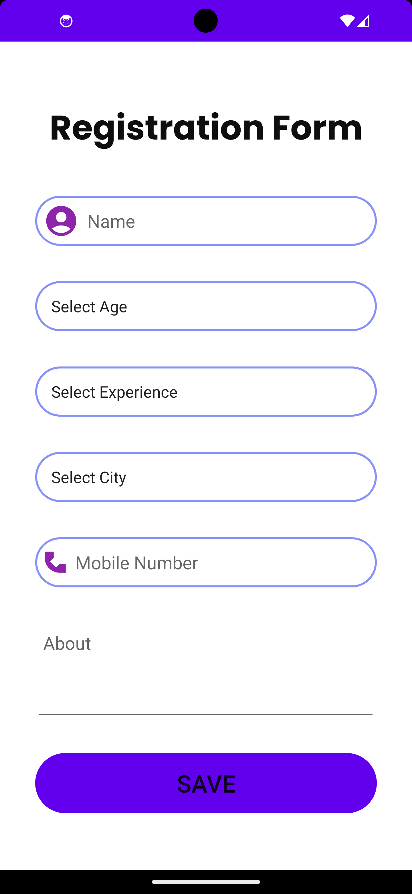

# QuickFix-App

QuickFix is a service application designed to connect users with skilled mechanics for repair and maintenance needs. This app features role-based login, a user-friendly dashboard, mechanic profiles with reviews and ratings, and contact options. Built using Firebase for authentication and data management, QuickFix provides a seamless user-mechanic interaction experience.

## Features
- **Role-Based Login**: Separate login flows for Users and Mechanics.
- **User Dashboard**: Displays a list of mechanics with profiles and contact options.
- **Mechanic Profiles**: Includes ratings, reviews, and detailed information.
- **Review System**: Users can rate and leave feedback for mechanics.
- **Firebase Integration**: Manages authentication, real-time database, and storage.

## Tech Stack
- **Frontend**: Android (Java/Kotlin)
- **Backend**: Firebase Realtime Database, Firebase Authentication

## Installation
1. Clone the repository:
   ```bash
   git clone https://github.com/your-username/QuickFix-App.git
   ```
2. Open the project in Android Studio.
3. Sync the Gradle files and resolve dependencies.
4. Configure Firebase:
   - Add `google-services.json` to the `app/` directory.
   - Enable Firebase Authentication and Realtime Database in the Firebase console.
5. Build and run the project on an emulator or physical device.

## Usage
1. **Signup/Login**: Users and mechanics can register and log in using their respective roles.
2. **Dashboard**: Users can view a list of mechanics and their details.
3. **Mechanic Details**: Click on a mechanic's profile to view ratings, reviews, and contact options.
4. **Submit Reviews**: Users can leave ratings and feedback after service.
   ## Screenshots

### 1. Welcome Screen


### 2. Login Screen


### 3. User Dashboard


### 4. Mechanic Profile


### 5. Signup Screen


### 6. Mechanic Registration


## Project Structure
- `activities/`: Contains the main activities for user and mechanic flows.
- `adapters/`: RecyclerView adapters for displaying data.
- `models/`: Data models for Firebase integration.
- `utils/`: Utility classes and helper functions.

## Firebase Configuration
Ensure you have the following Firebase features enabled:
- Firebase Authentication
- Firebase Realtime Database
- Firebase Storage (optional for profile images)

## Contribution
Contributions are welcome! To contribute:
1. Fork the repository.
2. Create a new branch for your feature or bug fix.
3. Submit a pull request with detailed changes.


## Contact
For queries or support, please reach out to [muhammadfaizan7852@gmail.com].


[def]: scree
